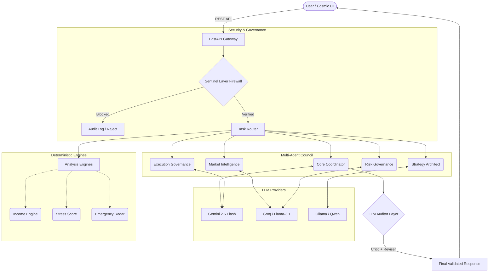
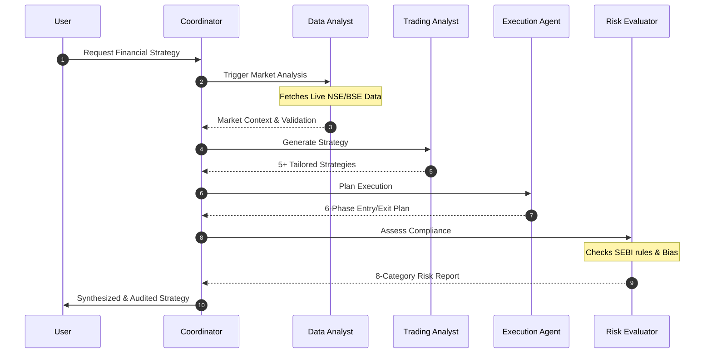

<div align="center">

# 🌌 NirvanaX
**Verified Financial Intelligence OS**

[](#)
[](#)
[](#)
[](#)

A trust-first, explainable, multi-agent governed financial intelligence platform tailored for Indian retail banking.
Combining real-time market data, institutional-grade AI advisory, ethical governance, and advanced hallucination prevention.

</div>

---

## 🚀 Overview

NirvanaX is an advanced Cyber-Fintech SaaS designed to deliver robust, multi-layered financial intelligence. By employing a deterministic multi-agent governance system, it ensures precision, compliance, and actionable insights specifically aligned with the NSE/BSE, SEBI, and RBI context.

## ✨ Key Features

- **Multi-Agent Governance:** The "Council of Five" agentic structure ensures synthesized, vetted, and consensus-driven advice.
- **Advanced Hallucination Prevention:** Inspired by Google ADK LLM Auditor, featuring real-time Critic and Reviser agents.
- **Institutional-Grade Workflow:** 4-Step sequential analysis encompassing data processing, trading strategies, execution planning, and strict risk evaluation.
- **Zero-Trust Security Layer:** Sentinel firewall that actively blocks prompt injections, prevents financial fraud, and audits LLM outputs.
- **Live Market Integration:** Real-time data streams utilizing Groww APIs and custom Indian financial APIs.

---

## 🏛️ System Architecture

NirvanaX leverages a hybrid backend utilizing robust FastAPI endpoints, deterministic rule engines, and multi-model LLM orchestration to guarantee secure and reliable interactions.



---

## 🔄 Multi-Agent Workflow

The core advisory is powered by a structured 4-step execution workflow that ensures every recommendation is backed by real-time data and rigorously evaluated for risk.



---

## 🛠️ Technology Stack

| Category | Technologies Used |
| :--- | :--- |
| **Frontend** | Vanilla HTML/CSS/JS, Chart.js, TradingView Widgets, Cosmic UI Design |
| **Backend** | Python 3.11+, FastAPI, Uvicorn |
| **Intelligence** | Gemini 2.5 Flash, Groq (Llama 3.1), Local Ollama |
| **Data Streams** | Groww API, IndianAPI.in, Google Custom Search API |
| **Database** | SQLite (Development), PostgreSQL (Production target) |
| **Deployment** | Vercel (Serverless), Docker |

---

## 🛡️ Security & Sentinel Layer

Security is a first-class citizen in NirvanaX. Our 4-layer pipeline operates under a zero-trust model:

1. **Deterministic Firewall:** 0ms regex-based layer blocking prompt injections and fraud.
2. **Critic Agent:** Extracts and verifies claims using deterministic sources.
3. **Reviser Agent:** Corrects inaccuracies while preserving tone.
4. **Engine Cross-Validation:** Algorithmic scoring (e.g., Stress Score, Income Variability) always overrides AI inferences.

---

## 🏁 Quick Start

### 1. Installation

```bash
# Clone the repository
git clone https://github.com/your-username/nirvanax.git
cd nirvanax

# Setup backend
cd backend
python -m venv venv
source venv/bin/activate  # On Windows use `venv\Scripts\activate`
pip install -r requirements.txt
```

### 2. Environment Configuration

```bash
cp backend/.env.example backend/.env
```
Ensure the following API keys are set in your `.env` file:
* `GEMINI_API_KEY`, `GROQ_API_KEY`, `GROWW_API_KEY`, `INDIAN_API_KEY`

### 3. Running Locally

**Start the Backend Engine:**
```bash
cd backend
python -m uvicorn app.main:app --reload --port 8000
```

**Start the Frontend Client:**
```bash
cd frontend
python serve.py
# Access dashboard at http://localhost:5173
```

---

## 🌐 Deployment

NirvanaX supports seamless deployment via Vercel for serverless environments.

[](https://vercel.com/new/clone?repository-url=https://github.com/your-username/nirvanax)

*Note: For complex multi-agent reasoning, consider deploying the FastAPI backend on Railway, Render, or an AWS EC2 instance to bypass Vercel's free-tier timeout limits.*

---

## ⚖️ Legal Disclaimer

All financial analysis, strategies, and recommendations provided by NirvanaX are **for educational and informational purposes only**. They do not constitute financial advice. Always consult a qualified independent financial advisor before making investment decisions. Past performance is not indicative of future results.

---
<div align="center">
<i>Proprietary — All Rights Reserved. Built for Indian Retail Banking.</i>
</div>
